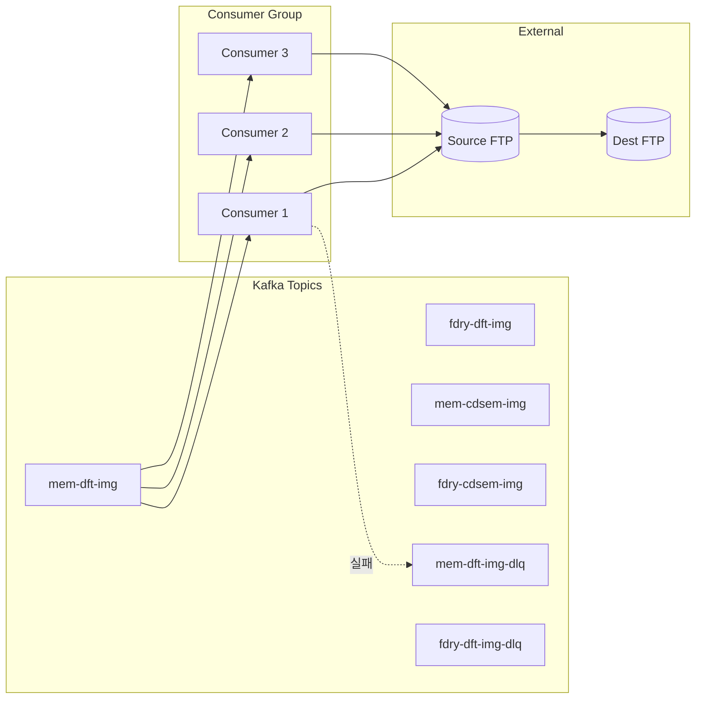
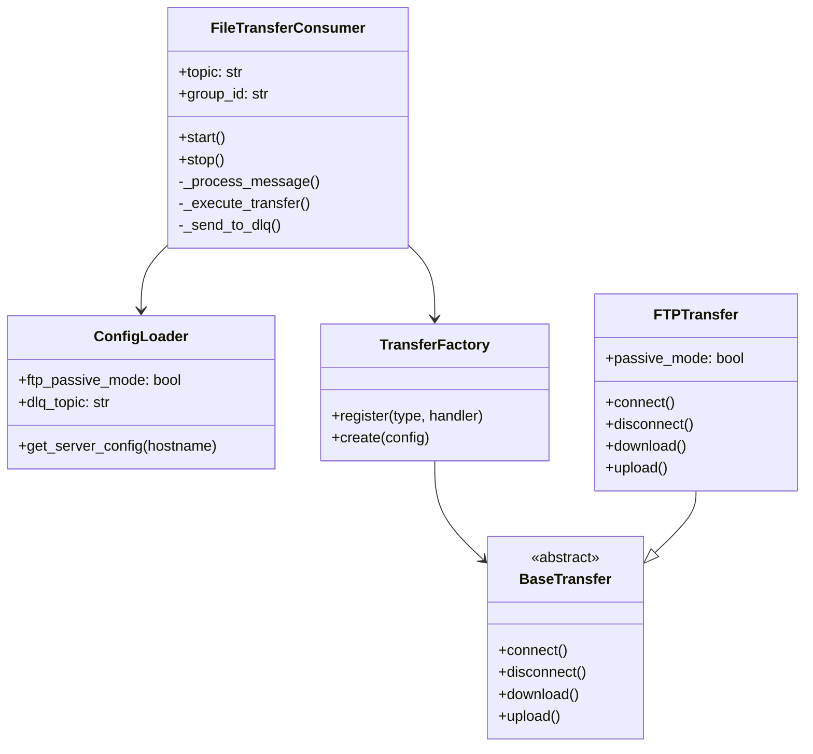
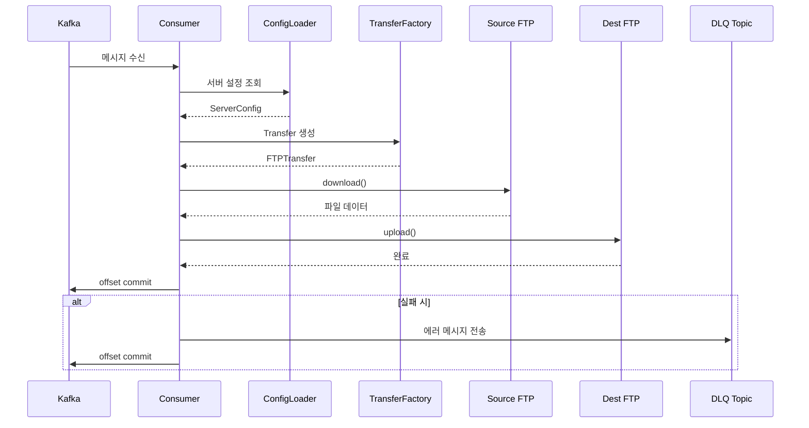

# ETL File Sync

Kafka 메시지 큐 기반 파일 전송 서비스입니다. FTP 서버 간 파일을 자동으로 전송합니다.

## 개요



> **병렬 처리**: 동일 토픽에 여러 Consumer를 실행하면 Kafka가 파티션을 자동 분배하여 병렬 처리합니다.

## 주요 기능

- **Kafka 기반 작업 큐**: 메시지 큐에서 파일 전송 작업을 읽어 처리
- **FTP 파일 전송**: Source FTP에서 Destination FTP로 파일 전송
- **DLQ 지원**: 실패한 작업은 Dead Letter Queue로 이동
- **단일 컨테이너 배포**: Kafka 브로커 + ETL Consumer를 하나의 컨테이너로 실행
- **확장 가능한 구조**: S3 등 다른 전송 프로토콜 추가 가능

## 기술 스택

| 구분 | 기술 |
|------|-----|
| Base Image | Rocky Linux 8 |
| Runtime | Python 3.12 |
| Message Queue | Apache Kafka 4.1.1 (KRaft 모드) |
| Kafka Client | kafka-python |

## 프로젝트 구조

```
etl-file-sync/
├── docker/
│   ├── Dockerfile           # 컨테이너 빌드 정의
│   ├── entrypoint.sh        # 컨테이너 시작 스크립트
│   └── supervisord.conf     # 프로세스 관리 설정
├── kafka/
│   └── config/
│       └── server.properties  # KRaft 단일 노드 설정
├── src/
│   └── etl/
│       ├── __init__.py
│       ├── main.py           # CLI 진입점
│       ├── consumer.py       # Kafka Consumer
│       ├── config.py         # 환경 설정 로더
│       ├── models/
│       │   └── message.py    # 메시지 스키마
│       └── transfer/
│           ├── base.py       # 추상 전송 클래스
│           └── ftp.py        # FTP 구현체
├── tests/                    # 테스트 코드
├── .env.example              # 환경변수 예시
├── requirements.txt          # 프로덕션 의존성
└── requirements-dev.txt      # 개발 의존성
```

## 설치 및 실행

### Docker 빌드

```bash
docker build -t etl-file-sync -f docker/Dockerfile .
```

### 실행

```bash
# 기본 실행
docker run --env-file .env etl-file-sync

# 토픽 및 옵션 지정
docker run --env-file .env etl-file-sync \
    --topic file-transfer-jobs \
    --group-id etl-worker-1 \
    --bootstrap-servers localhost:9092
```

### CLI 옵션

| 옵션 | 설명 | 기본값 |
|------|-----|--------|
| `--topic` | 구독할 Kafka 토픽 | `file-transfer-jobs` |
| `--group-id` | Consumer 그룹 ID | `etl-worker-group` |
| `--bootstrap-servers` | Kafka 브로커 주소 | `localhost:9092` |
| `--env-file` | .env 파일 경로 | - |
| `-v, --verbose` | 디버그 로그 활성화 | `false` |

## 병렬 처리 실행

### 동일 토픽에 여러 프로세스 실행

Kafka의 Consumer Group 메커니즘을 활용하여 동일 토픽을 여러 프로세스가 병렬로 처리할 수 있습니다.

```bash
# mem-dft-img 토픽에 3개 프로세스 (Kafka 파티션 수에 맞춤)
docker run -d --name etl-mem-dft-1 --env-file .env etl-file-sync \
    --topic mem-dft-img --group-id etl-worker-group

docker run -d --name etl-mem-dft-2 --env-file .env etl-file-sync \
    --topic mem-dft-img --group-id etl-worker-group

docker run -d --name etl-mem-dft-3 --env-file .env etl-file-sync \
    --topic mem-dft-img --group-id etl-worker-group
```

> **중요**:
> - 동일한 `--group-id`를 사용하면 Kafka가 자동으로 파티션을 분배합니다.
> - 프로세스 수는 토픽의 파티션 수 이하로 설정하세요 (초과 시 일부 프로세스는 유휴 상태).

### Docker Compose로 관리 (권장)

`docker-compose.parallel.yml`을 사용하여 여러 프로세스를 한 번에 관리할 수 있습니다.

```bash
# 전체 프로세스 시작
docker-compose -f docker-compose.parallel.yml up -d

# 로그 확인
docker-compose -f docker-compose.parallel.yml logs -f etl-mem-dft-1

# 전체 중지
docker-compose -f docker-compose.parallel.yml down
```

### Consumer Group 모니터링

```bash
# Consumer Group 상태 확인
kafka-consumer-groups.sh --describe \
    --group etl-worker-group \
    --bootstrap-server localhost:9092
```

출력 예시:
```
TOPIC           PARTITION  CURRENT-OFFSET  LOG-END-OFFSET  LAG  CONSUMER-ID
mem-dft-img     0          100             100             0    consumer-1
mem-dft-img     1          98              100             2    consumer-2
mem-dft-img     2          102             102             0    consumer-3
```

### Kafka 토픽 생성

```bash
# 파티션 수 = 최대 동시 실행할 프로세스 수
kafka-topics.sh --create \
    --topic mem-dft-img \
    --partitions 3 \
    --bootstrap-server localhost:9092

# DLQ 토픽 (파티션 1개로 충분)
kafka-topics.sh --create \
    --topic mem-dft-img-dlq \
    --partitions 1 \
    --bootstrap-server localhost:9092
```

## 환경 설정

`.env.example`을 복사하여 `.env` 파일을 생성하세요.

```bash
cp .env.example .env
```

### 환경변수

```bash
# FTP 전역 설정
FTP_PASSIVE_MODE=true              # Passive 모드 (기본값: true)

# DLQ 설정
DLQ_TOPIC_SUFFIX=-dlq              # DLQ 토픽 suffix (토픽별 자동 생성)
                                   # 예: mem-dft-img -> mem-dft-img-dlq

# 서버 정의 형식: {HOSTNAME}_{PROPERTY}
SRC_FTP_SERVER1_TYPE=ftp
SRC_FTP_SERVER1_HOST=ftp.source.com
SRC_FTP_SERVER1_PORT=21
SRC_FTP_SERVER1_USER=username
SRC_FTP_SERVER1_PASS=password

DST_FTP_SERVER1_TYPE=ftp
DST_FTP_SERVER1_HOST=ftp.dest.com
DST_FTP_SERVER1_PORT=21
DST_FTP_SERVER1_USER=username
DST_FTP_SERVER1_PASS=password
```

### DLQ 토픽 매핑

실패한 메시지는 소스 토픽에 suffix를 붙여 자동 생성된 DLQ 토픽으로 전송됩니다.

| 소스 토픽 | DLQ 토픽 |
|----------|---------|
| mem-dft-img | mem-dft-img-dlq |
| fdry-dft-img | fdry-dft-img-dlq |
| mem-cdsem-img | mem-cdsem-img-dlq |
| fdry-cdsem-img | fdry-cdsem-img-dlq |

## 메시지 스키마

### 파일 전송 작업 메시지

```json
{
    "job_id": "550e8400-e29b-41d4-a716-446655440000",
    "source": {
        "hostname": "SRC_FTP_SERVER1",
        "path": "/data/input/file.csv"
    },
    "destination": {
        "hostname": "DST_FTP_SERVER1",
        "path": "/data/output/file.csv"
    }
}
```

| 필드 | 설명 | 필수 |
|------|-----|------|
| `job_id` | 작업 고유 ID (UUID) | 선택 (자동생성) |
| `source.hostname` | .env에 정의된 서버 hostname | 필수 |
| `source.path` | 원본 파일 경로 | 필수 |
| `destination.hostname` | .env에 정의된 서버 hostname | 필수 |
| `destination.path` | 대상 파일 경로 | 필수 |

### DLQ 메시지

실패한 작업은 DLQ 토픽으로 전송됩니다.

```json
{
    "original_message": { ... },
    "error": "ConnectionRefused: ftp.source.com:21",
    "timestamp": "2025-12-08T10:30:00Z",
    "retry_count": 0
}
```

## 테스트

### 테스트 분류

| 마커 | 설명 | 인프라 필요 |
|------|-----|-----------|
| `@pytest.mark.unit` | 단위 테스트 (Mock 기반) | X |
| `@pytest.mark.integration` | FTP 통합 테스트 | O (FTP) |
| `@pytest.mark.e2e` | E2E 테스트 | O (FTP + Kafka) |

> **중요**: 통합/E2E 테스트는 인프라가 없으면 **FAIL** 합니다 (skip 아님).

### 테스트 환경 설정

```bash
# 가상환경 생성
python -m venv .venv
source .venv/bin/activate

# 의존성 설치
pip install -r requirements.txt
pip install -r requirements-dev.txt
```

### 테스트 실행

#### 단위 테스트만 (인프라 불필요)

```bash
pytest -m unit -v
```

#### 전체 테스트 (인프라 필요)

**사전 요구사항:**
- 실제 FTP 서버 (192.168.1.4)가 준비되어 있어야 합니다
- `.env.test` 파일에 FTP 서버 연결 정보가 설정되어 있어야 합니다

```bash
# 1. Docker 이미지 빌드 (최초 1회)
docker build -t etl-file-sync -f docker/Dockerfile .

# 2. Kafka 테스트 인프라 시작
docker-compose -f docker-compose.test.yml up -d

# 3. Kafka 토픽 생성 (최초 1회)
docker exec etl-test /opt/kafka/bin/kafka-topics.sh \
    --bootstrap-server localhost:9092 \
    --create --topic test-transfer --partitions 1 --replication-factor 1

docker exec etl-test /opt/kafka/bin/kafka-topics.sh \
    --bootstrap-server localhost:9092 \
    --create --topic test-transfer-dlq --partitions 1 --replication-factor 1

# 4. Consumer 재시작 (토픽 생성 후)
docker exec etl-test supervisorctl restart etl-consumer

# 5. 전체 테스트 실행
pytest -v --cov=src/etl --cov-report=term-missing
```

#### 특정 테스트만

```bash
# FTP 통합 테스트만
pytest -m integration -v

# E2E 테스트만
pytest -m e2e -v

# 헬스체크 테스트 (인프라 상태 확인)
pytest tests/test_health.py -v
```

### 테스트 커버리지

현재 커버리지: **88%**

```
Name                           Stmts   Miss  Cover
--------------------------------------------------
src/etl/config.py                 42      6    86%
src/etl/consumer.py               99     16    84%
src/etl/main.py                   55      1    98%
src/etl/models/message.py         44      0   100%
src/etl/transfer/base.py          34      4    88%
src/etl/transfer/ftp.py           81     16    80%
--------------------------------------------------
TOTAL                            361     43    88%
```

### 테스트 환경 정리

```bash
docker-compose -f docker-compose.test.yml down -v
```

## 아키텍처

### 컴포넌트 다이어그램



### 처리 흐름



## 확장 계획

- [ ] S3 Transfer 지원
- [ ] SFTP Transfer 지원
- [ ] 재시도 로직 (exponential backoff)
- [ ] 메트릭 수집 (Prometheus)
- [ ] 파일 무결성 검증 (checksum)

## 라이선스

MIT License
